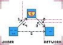
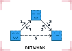

# n2n-overlay-wrtc [](https://travis-ci.org/RAN3D/n2n-overlay-wrtc)

This project aims to ease the creation of overlay networks on top of
WebRTC. Additional WebRTC-specific constraints make such projects more difficult
than they should be. For instance, establishing a connection requires a
round-trip of "offers". Such messages usually transit a dedicated signaling
server. The peers of this project still require a signaling server for their
entrance in the network. Afterwards, peers become signaling servers too, i.e.,
they mediate connections between their direct neighbors.

This module divides the entering arcs (inview) from the outgoing arcs (outview).

The way connections are handled are left to the discretion of overlay protocols
built on top of this module. A peer with two neighbors can ask to one of them to
connect to the other. Several overlay network protocols use neighbor-to-neighbor
interactions to converge to a topology exposing the desired properties.

## Principle

<p align='center'>
 </img>
</p>

There exists a network comprising at least Peer ```:|```. Peer ```:]``` wants to
join this network. ```:|``` knows it and opens an access to the network thanks
to a signaling server. The signaling server is in charge of transmitting the
necessary WebRTC data from both sides. The figure shows this protocol with the
1->2->3->4 steps that can be repeated many times depending on network
configurations. If the protocol is successful, it creates a direct
browser-to-browser connection from ```:]``` to ```:|```.

<p align='center'>
 </img>
</p>

Peers already in the network do not need to use a signaling server to establish
connections, for each of them can act as a signaling server, i.e. as a bridge
from a neighbor to another. In the figure, ```:3```, ```:]```, and ```:|``` are
in the network. ```:3``` can establish a WebRTC connection to ```:|``` using
```:]```. Such neighbor-to-neighbor connections are common in distributed
peer-sampling protocols.


## Installation

```$ npm install n2n-overlay-wrtc```

## API

The API is avalaible [here](https://ran3d.github.io/n2n-overlay-wrtc/)

## Example

A live example is available
[here](https://ran3d.github.io/n2n-overlay-wrtc/example/browser.html).

The module [spray-wrtc](https://github.com/ran3d/spray-wrtc) extends
n2n-overlay-wrtc to implement a random peer-sampling protocol.

